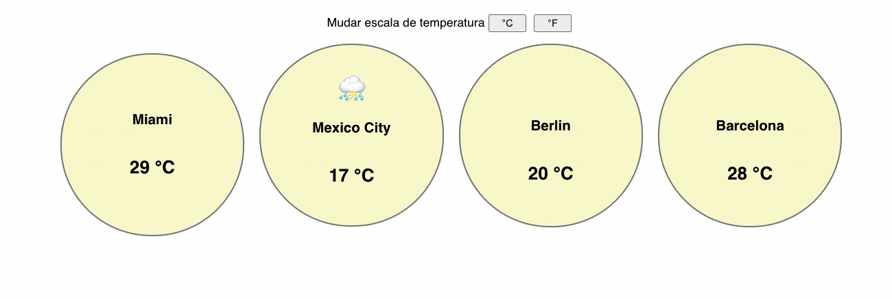

# MINILAB - Widget de Tempo

O objetivo deste minilab é praticar props em conjunto com state

## Requerimentos

- Faça um fork deste repositório
- Clone este repositório
- Dentro da pasta do projeto, execute `npm install` em seu terminal para instalar todas as dependências
- Execute `npm start` para abrir o projeto em seu navegador

## Instruções

O objetivo do exercício é obter um resultado semelhante à esse:



### Passo 1: Componente WeatherWidget

Usando `props`, desenvolva um componente chamado `WeatherWidget` que exibe a temperatura (prop `celsius`) em graus Celsius ou Fahrenheit (prop `unit`), a cidade (prop `city`) e um ícone do tempo atual dessa cidade (prop `icon`). Ao invocar esse componente você deve ter algo assim:

```javascript
<WeatherWidget city="Miami" icon="" celsius={29} unit={unit} />
```

> Dica: a fórmula para transformar Celsius em Fahrenheit é:
> celsius \* 1.8 + 32

### Passo 2: Botões da escala de temperatura

No `App.js`, crie um botão com o texto "°C" e outro com o texto "°F". Esses botões irão modificar seu `state`, o qual deve conter qual a escala de temperatura atual do aplicativo. Por padrão, faça com que o `state` inicial seja a string "C". Ao clicar no botão "°F", o state deve passar a ser a string "F".

### Passo 3: Ligando um ao outro

Agora que seu `state` está configurado, ao trocar a escala de temperatura, você deve ver os graus na escala escolhida em sua tela, dentro de cada componente `WeatherWidget` que foi invocado :)
